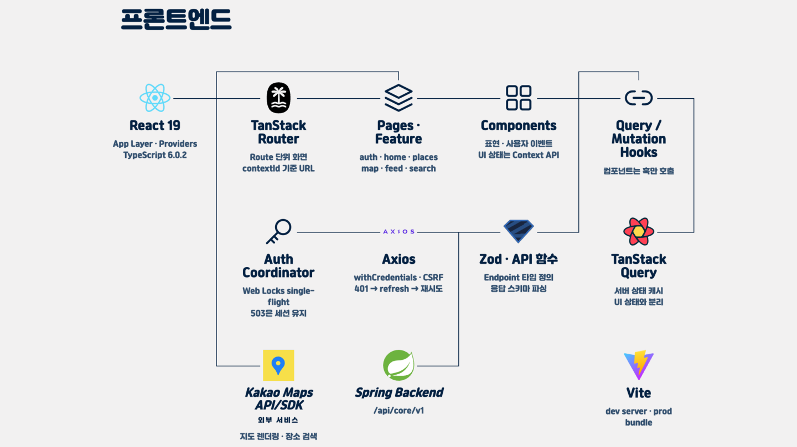

# PinLog Frontend

장소를 저장한 이유와 경험을 `Context`로 기록하고, 자연어 검색과 익명 `Collection`을 통해 다시 찾고 발견하는 PinLog의 PC 웹 클라이언트입니다.

## 시스템 아키텍처



이 저장소는 브라우저에서 실행되는 React SPA와 그 정적 배포 산출물의 경계를 담당합니다. 운영에서는 같은 오리진의 경로 라우팅으로 `/`는 프론트엔드, `/api/core/`는 Spring Backend에 연결됩니다. Spring 단일 애플리케이션이 BFF와 리소스 서버 역할을 함께 수행하며, 프론트엔드는 서버의 내부 계층이나 토큰을 직접 다루지 않습니다.

주요 요청 흐름은 다음과 같습니다.

```text
Page
  → Feature Component
    → Query/Mutation Hook (TanStack Query)
      → Feature API 함수 + Zod 응답 스키마
        → Axios HTTP Client
          → Spring Backend (/api/core/v1)
```

- **라우팅과 서버 상태**: TanStack Router가 페이지와 인증 가드를 구성하고, TanStack Query의 Query/Mutation Hook이 조회·변경·캐시 무효화를 담당합니다.
- **화면 계층**: `pages/`는 라우트 단위 화면, `features/`는 도메인별 `api`·`hooks`·`components`·`lib`, `shared/`는 공용 HTTP·UI·유틸리티를 소유합니다. Page와 Component는 Axios를 직접 호출하지 않고 Feature Hook을 통해 서버 상태를 사용합니다.
- **API 경계**: 엔드포인트별 API 함수가 요청·응답 타입을 소유하고 Zod로 응답을 파싱합니다. 공통 Axios 클라이언트는 성공 봉투 해제, 오류 정규화, 쿠키 전송과 인증 복구를 담당합니다.
- **쿠키·CSRF 인증**: Axios는 `withCredentials`로 서버가 관리하는 `HttpOnly` 인증 쿠키를 전송합니다. 상태 변경 요청에는 `XSRF-TOKEN` 쿠키를 `X-XSRF-TOKEN` 헤더로 전달하며, 프론트엔드는 Bearer 토큰을 저장하거나 구성하지 않습니다.
- **Auth Coordinator**: API 요청이 `401`을 받으면 Access 갱신 후 원 요청을 한 번 재시도합니다. 탭 내부 Promise 공유와 Web Locks 기반 탭·창 간 직렬화로 회전형 Refresh를 single-flight 처리하며, Web Locks 미지원 환경에서는 탭 내부 조정으로 폴백합니다. `503`은 인증 거절이 아닌 일시 장애로 분리해 세션을 유지합니다.
- **지도 경계**: 새 장소 검색은 Kakao Local REST API를, 지도 표시는 Kakao Maps JavaScript SDK를 브라우저에서 직접 사용합니다. 반면 내 기록 검색·자연어 검색·저장과 권한 검증은 Spring Backend API가 담당합니다.

세부 규약은 [아키텍처](docs/architecture.md), [API 계약](docs/api-contract.md), [인증 설계](docs/reference/11_인증_설계.md)를 기준으로 합니다. 위 이미지는 시스템을 요약하며, 구현 세부가 다를 때는 현재 코드와 이 문서들을 우선합니다.

## 기술 스택

아래 버전은 현재 `package-lock.json`에 고정된 해석 결과입니다.

| 영역             | 기술                                                |
| ---------------- | --------------------------------------------------- |
| UI               | React 19.2.8, React DOM 19.2.8, Tailwind CSS 3.4.19 |
| 언어·빌드        | TypeScript 6.0.3, Vite 8.1.5                        |
| 라우팅·서버 상태 | TanStack Router 1.170.18, TanStack Query 5.101.4    |
| HTTP·스키마·폼   | Axios 1.18.1, Zod 4.4.3, React Hook Form 7.83.0     |
| 품질             | Vitest 4.1.10, ESLint 10.8.0, Prettier 3.9.6        |

## 저장소 구조

```text
src/
  app/          # Router, Query Provider, 전역 레이아웃
  pages/        # 라우트 단위 Page
  features/     # 도메인별 API, Query/Mutation Hook, Component, lib
  shared/       # 공용 HTTP Client, UI Component, 유틸리티
  contexts/     # 서버 상태와 분리된 UI 상태 Context
docs/
  reference/       # 동기화된 원본 기획·정책·API 문서
  troubleshooting/ # 재현 조건과 해결 기록
infra/frontend-image/ # Nginx 정적 이미지 계약
```

현재 Feature는 `auth`, `collections`, `feed`, `follows`, `home`, `layout`, `map`, `me`, `paper`, `places`, `records`, `search`로 구성됩니다. 더 자세한 책임과 상태 분리 원칙은 [docs/architecture.md](docs/architecture.md)를 확인하세요.

## 로컬 실행

CI 기준 런타임은 Node.js 22와 npm입니다.

1. 의존성을 lockfile 그대로 설치합니다.

   ```bash
   npm ci
   ```

2. `.env.example`을 `.env`로 복사하고 아래 이름의 로컬 값을 준비합니다. 값은 이 저장소나 문서에 커밋하지 않습니다.

   - `VITE_API_BASE_URL`
   - `VITE_KAKAO_REST_KEY`
   - `VITE_KAKAO_JS_KEY`

   모든 `VITE_*` 값은 브라우저 번들에 포함되는 공개 빌드 설정입니다. 민감한 credential을 넣지 말고, Kakao 키는 Kakao Developers 콘솔에서 앱과 Web 플랫폼 도메인을 등록해 준비합니다. 로컬 API·이미지 경로의 프록시 규칙은 `vite.config.ts`를 따릅니다.

3. 개발 서버를 시작합니다.

   ```bash
   npm run dev
   ```

## 개발 명령

| 명령                | 설명                                           |
| ------------------- | ---------------------------------------------- |
| `npm run dev`       | Vite 개발 서버 실행                            |
| `npm run build`     | TypeScript project build 후 프로덕션 번들 생성 |
| `npm run preview`   | 생성된 Vite 번들 로컬 미리보기                 |
| `npm run lint`      | 전체 ESLint 검사                               |
| `npm run typecheck` | TypeScript project build 기반 타입 검사        |
| `npm run test`      | Vitest 전체 테스트 1회 실행                    |
| `npm run format`    | Prettier로 지원 파일을 수정 포맷팅             |

## 빌드와 배포 경계

- Vite가 `VITE_*` 설정을 빌드 시점에 `dist`에 포함하므로 설정 변경에는 이미지 재빌드가 필요합니다. Kubernetes 런타임 환경변수로 기존 번들을 바꿀 수 없습니다.
- CI는 lint·typecheck·build·test를 거쳐 검증된 `dist`와 Nginx 설정으로 비루트 정적 이미지를 만듭니다.
- 이미지의 Nginx는 컨테이너 포트 `8080`에서 서비스하며, startup/readiness/liveness probe 계약은 `GET /healthz`입니다. SPA 경로는 `index.html`로 폴백하지만 `/api/*`는 프론트 이미지가 처리하지 않습니다.
- 이미지 태그·digest가 확정된 뒤 실제 Kubernetes 배포 변경은 Infra 저장소의 GitOps 경계에서 수행합니다.

공급망과 런타임의 상세 계약은 [Frontend image runtime contract](docs/frontend-image-runtime-contract.md)를 확인하세요.

## 문서

- [Quick Start](docs/reference/00_Quick_Start.md) — 서비스와 핵심 도메인 개요
- [아키텍처](docs/architecture.md) — 데이터 흐름, 폴더 책임, 상태 분리
- [API 계약](docs/api-contract.md) — 구현 기준 API·인증·오류 계약
- [컨벤션](docs/conventions.md) — 용어, 코드, Git 작업 규칙
- [Privacy Rules](docs/privacy-rules.md) — 공개 범위와 노출 금지 정보
- [참조 문서 안내](docs/reference/README.md) — 기획·정책·데이터 모델 원본 목록
- [Troubleshooting](docs/troubleshooting/README.md) — 재현 가능한 문제 해결 기록
